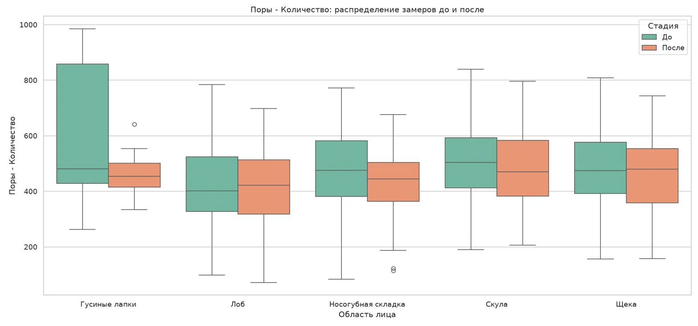
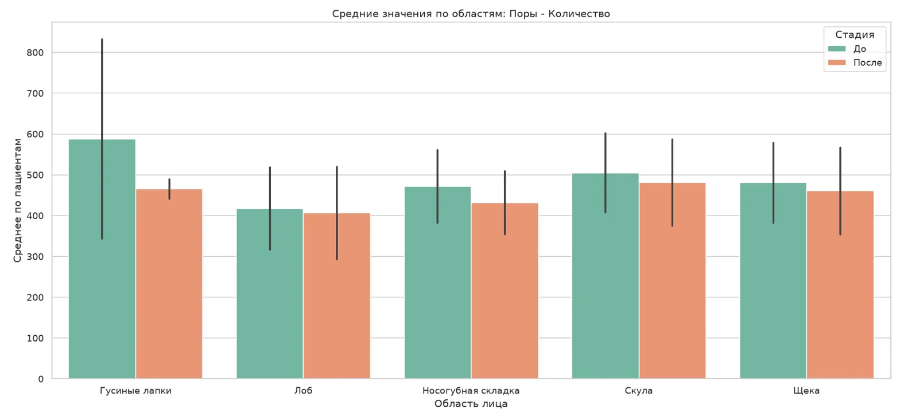
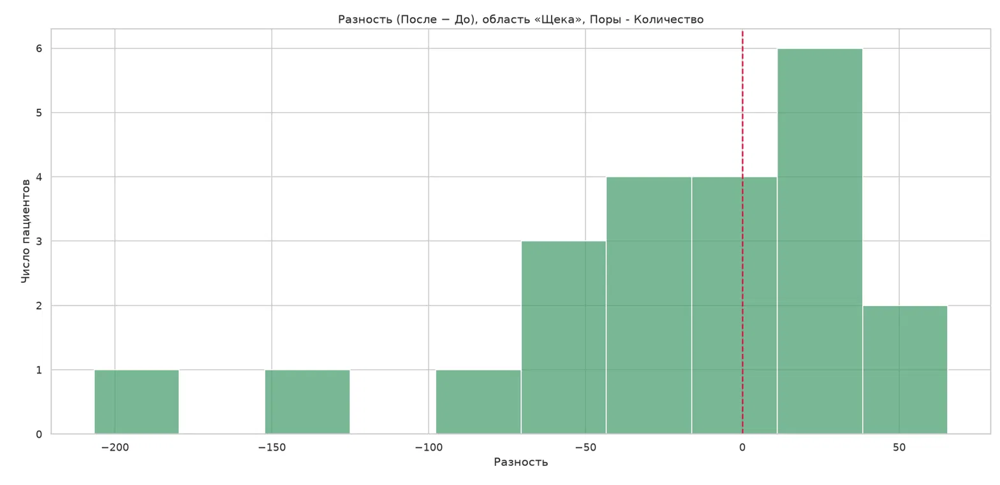
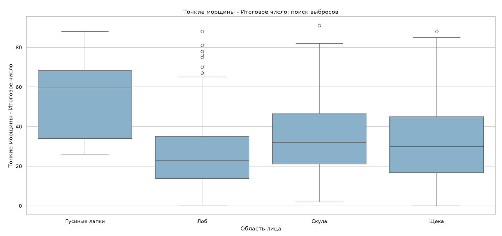

# Разведочный анализ данных: состояние кожи лица до и после применения крема

**Автор:** Фоминых Владимир, РИ-160911

---

## Содержание

- [1. Введение](#1-введение)
   - [Источник данных](#источник-данных)
   - [Структура файла](#структура-файла)
   - [Особенности «грязных» данных](#особенности-грязных-данных)
   - [Цель работы](#цель-работы)
- [2. Загрузка и очистка данных](#2-загрузка-и-очистка-данных)
   - [2.1. Импорты и константы](#21-импорты-и-константы)
   - [2.2. Первичный осмотр одного файла](#22-первичный-осмотр-одного-файла)
   - [2.3. Функции очистки](#23-функции-очистки)
   - [2.4. Сборка всех пациентов в один DataFrame](#24-сборка-всех-пациентов-в-один-dataframe)
   - [2.5. Контроль качества после очистки](#25-контроль-качества-после-очистки)
- [3. Описательная статистика](#3-описательная-статистика)
   - [3.1. Методика агрегации](#31-методика-агрегации)
   - [3.2. Сводная таблица «показатель × область»](#32-сводная-таблица-показатель--область)
   - [3.3. Разброс между пациентами](#33-разброс-между-пациентами)
   - [3.4. Динамика по пациентам](#34-динамика-по-пациентам)
- [4. Визуализация](#4-визуализация)
   - [4.1. Boxplot: распределение «До» и «После» по областям](#41-boxplot-распределение-до-и-после-по-областям)
   - [4.2. Столбчатая диаграмма средних значений](#42-столбчатая-диаграмма-средних-значений)
   - [4.3. Гистограмма разностей для одной области](#43-гистограмма-разностей-для-одной-области)
   - [4.4. Поиск аномалий](#44-поиск-аномалий)
- [5. Выводы](#5-выводы)
   - [5.1. Числовая основа для выводов](#51-числовая-основа-для-выводов)
   - [5.2. Что показали данные](#52-что-показали-данные)
   - [5.3. Ограничения работы](#53-ограничения-работы)

---

## 1. Введение

### Источник данных

Данные получены с аппаратного комплекса для анализа состояния кожи лица.
Каждый CSV-файл соответствует одному пациенту, имя файла — фамилия пациента.

### Структура файла

Внутри файла — многократные измерения разных областей лица, выполненные в два
визита: **до** применения крема и **после**. Одна строка — один снимок одной
области в один момент времени.

Колонки делятся на четыре смысловые группы:

| Группа | Примеры колонок | Что описывает |
|---|---|---|
| Служебные | `Image context`, `Изображение`, `Отметка времени` | Область лица, файл снимка, дата и время |
| Настройки прибора | `Выбор.3`, `Канал.4`, `... - Filter [mm]`, `... - Threshold [mm]` | Параметры алгоритма распознавания |
| Поры | `Поры - Количество`, `Поры - Плотность [cm⁻²]`, `Поры - Общий объём [mm³]` | Характеристики пор |
| Морщины | `Тонкие морщины - Итоговое число`, `Складки - Длина [mm]` | Характеристики морщин двух типов |

### Особенности «грязных» данных

1. **Десятичный разделитель — запятая** (`0,0149`), из-за чего pandas читает
   числовые колонки как текст.
2. **BOM в начале файла** — невидимая метка кодировки, приклеивающаяся к имени
   первой колонки.
3. **Пропуски**: тонкие морщины прибор считает не во всех областях, складки —
   лишь в части снимков.
4. **Дата в русском текстовом формате** — `9 июля 2026 г. 16:01:44`.
5. **Симметричные области** записаны раздельно: левая и правая щека, левая и
   правая скула и так далее.

### Цель работы

Описательными методами оценить, как изменились показатели состояния кожи между
первым и вторым визитом, в разрезе укрупнённых областей лица.
Статистический вывод (p-value, смешанные модели) не проводится.

## 2. Загрузка и очистка данных

### 2.1. Импорты и константы

<details>
<summary>Код</summary>

```python
import re
from pathlib import Path

import pandas as pd
import matplotlib.pyplot as plt
import seaborn as sns

pd.set_option('display.width', 200)
pd.set_option('display.max_columns', 50)

plt.rcParams['font.family'] = 'DejaVu Sans'
sns.set_theme(style='whitegrid', font='DejaVu Sans')

DIRECTORY = Path('data')      # папка с CSV-файлами; Path('.') если они рядом с ноутбуком
ENCODING = 'utf-8-sig'        # 'sig' = BOM, метка кодировки в начале файла

MONTHS_RU = {
    'января': 1, 'февраля': 2, 'марта': 3, 'апреля': 4,
    'мая': 5, 'июня': 6, 'июля': 7, 'августа': 8,
    'сентября': 9, 'октября': 10, 'ноября': 11, 'декабря': 12,
}

# колонки, которые не должны превращаться в числа
NON_NUMERIC = {
    'Image context', 'Изображение', 'Отметка времени',
    'Поры - Pore Type', 'patient', 'region', 'date', 'stage',
}
```

</details>

### 2.2. Первичный осмотр одного файла

Смотрим на сырые данные до всякой обработки: размер, типы, пропуски.

<details>
<summary>Код</summary>

```python
sample_path = sorted(DIRECTORY.glob('*.csv'))[0]
raw = pd.read_csv(sample_path, sep=';', encoding=ENCODING)

print('файл:', sample_path.name)
print('размер:', raw.shape, '— строк x колонок')
print('\nпервые строки:')
display(raw.head(3))

print('\nтипы данных:')
print(raw.dtypes.value_counts().to_string())

print('\nтоп-10 колонок по числу пропусков:')
print(raw.isna().sum().sort_values(ascending=False).head(10).to_string())

print('\nобластей съёмки:', raw['Image context'].nunique())
for v in raw['Image context'].unique():
    print('  -', v)
```

</details>

**Наблюдение.** Полностью пустые и почти пустые колонки — не ошибка выгрузки.
Прибор рассчитывает не все метрики для всех областей: например, тонкие морщины
не измеряются на носогубной складке, а складки — только там, где алгоритм нашёл
достаточно длинные линии. Пустая ячейка означает «показатель для этой области
не применим», а не «данные потеряны».

### 2.3. Функции очистки

Три вспомогательные функции: разбор русской даты, укрупнение областей лица и
полная подготовка одного файла.

<details>
<summary>Код</summary>

```python
def parse_ru_date(s):
    """'9 июля 2026 г. 16:01:44' -> Timestamp('2026-07-09'). Время отбрасывается."""
    m = re.search(r'(\d{1,2})\s+([а-яё]+)\s+(\d{4})', str(s).lower())
    if not m:
        return pd.NaT
    day, month_name, year = m.groups()
    month = MONTHS_RU.get(month_name)
    if month is None:
        return pd.NaT
    return pd.Timestamp(int(year), month, int(day))


def merge_region(r):
    """Объединение симметричных областей: 'Левая щека' -> 'Щека'."""
    if pd.isna(r):
        return None
    low = str(r).lower()
    if 'щек' in low:
        return 'Щека'
    if 'скул' in low:
        return 'Скула'
    if 'носогуб' in low:
        return 'Носогубная складка'
    if 'лоб' in low or 'лба' in low:
        return 'Лоб'
    if 'лапк' in low:
        return 'Гусиные лапки'
    return str(r).strip()


def prepare(df, patient):
    """Фильтр All Pores, область, дата, перевод чисел из запятой в точку."""
    df = df.copy()
    df.columns = [col.strip() for col in df.columns]
    df['patient'] = patient

    # оставляем только сводные строки по всем порам
    if 'Поры - Pore Type' in df.columns:
        df = df[df['Поры - Pore Type'] == 'All Pores'].copy()

    # '8 областей - Левая щека' -> 'Левая щека' -> 'Щека'
    df['region'] = (df['Image context'].astype(str)
                    .str.split(' - ', n=1).str[1]
                    .apply(merge_region))

    df['date'] = df['Отметка времени'].apply(parse_ru_date)

    for col in df.columns:
        if col in NON_NUMERIC or col.startswith(('Выбор', 'Канал')):
            continue
        df[col] = pd.to_numeric(
            df[col].astype(str).str.replace(',', '.', regex=False),
            errors='coerce'
        )

    return df
```

</details>

### 2.4. Сборка всех пациентов в один DataFrame

Каждый файл читается, проходит `prepare()` и складывается в список; склейка —
одним вызовом `pd.concat()` в конце. Стадия визита определяется по дате:
самая ранняя дата пациента — «До» (`stage = 0`), все прочие — «После» (`stage = 1`).

<details>
<summary>Код</summary>

```python
files = sorted(DIRECTORY.glob('*.csv'))
print('папка:', DIRECTORY.resolve())
print('найдено CSV:', len(files))
assert files, 'CSV не найдены — поправь DIRECTORY'

all_dfs = [prepare(pd.read_csv(f, sep=';', encoding=ENCODING), f.stem)
           for f in files]
big = pd.concat(all_dfs, ignore_index=True)

# transform('min') возвращает результат той же длины, что таблица,
# подставляя каждой строке минимальную дату её пациента
first_visit = big.groupby('patient')['date'].transform('min')
big['stage'] = (big['date'] != first_visit).astype(int)
big['Стадия'] = big['stage'].map({0: 'До', 1: 'После'})

print(f'\nпациентов: {big["patient"].nunique()} | строк: {len(big)}')
print('стадии:', big['stage'].value_counts().to_dict())
print('области:', sorted(big['region'].dropna().unique()))
```

</details>

### 2.5. Контроль качества после очистки

Проверяем, что дата распарсилась у всех, стадии распределились осмысленно,
а число замеров «До» и «После» сопоставимо.

<details>
<summary>Код</summary>

```python
print('не распарсилось дат:', big['date'].isna().sum())
print('уникальных дат:', big['date'].nunique())

per_patient = (big.pivot_table(index='patient', columns='Стадия',
                               values='region', aggfunc='size')
                 .fillna(0).astype(int))
per_patient['всего'] = per_patient.sum(axis=1)
per_patient['областей'] = big.groupby('patient')['region'].nunique()

print('\nзамеров по пациентам:')
display(per_patient)
```

</details>

**Наблюдение.** Разное число областей у пациентов объясняется тем, что не всем
снимали полный набор зон: часть протоколов съёмки короче. Для анализа это
означает, что сравнивать области нужно с оглядкой на число пациентов,
у которых эта область вообще есть.

## 3. Описательная статистика

### 3.1. Методика агрегации

Усреднение двухступенчатое:

1. Сначала повторные замеры внутри одного пациента сворачиваются в одно число
   для каждой пары «область × стадия».
2. Только потом считается среднее по пациентам.

Порядок важен: без первого шага пациент с шестью снимками щеки весил бы втрое
больше пациента с двумя, и среднее сместилось бы в его сторону.

<details>
<summary>Код</summary>

```python
indicators = [
    'Поры - Количество',
    'Тонкие морщины - Итоговое число',
    'Тонкие морщины - Средняя глубина [mm]',
]

missing = [c for c in indicators if c not in big.columns]
assert not missing, f'нет колонок: {missing}'

print('типы:', big[indicators].dtypes.astype(str).to_dict())
print('пропусков:', big[indicators].isna().sum().to_dict())


def per_patient_means(df, indicator):
    """Одно число на пациента × область × стадию."""
    return (df.groupby(['patient', 'region', 'stage'])[indicator]
              .mean().reset_index()
              .dropna(subset=[indicator]))
```

</details>

### 3.2. Сводная таблица «показатель × область»

Для каждого показателя и каждой области: сколько пациентов дали данные,
средние «До» и «После», абсолютная и относительная разница.

<details>
<summary>Код</summary>

```python
parts = []
for ind in indicators:
    means = per_patient_means(big, ind)

    wide = means.pivot_table(index='region', columns='stage', values=ind)
    wide = wide.rename(columns={0: 'mean_before', 1: 'mean_after'})
    wide.columns.name = None

    n = means.groupby('region')['patient'].nunique().rename('n_patients')

    part = pd.concat([n, wide], axis=1).reset_index()
    part['indicator'] = ind
    parts.append(part)

summary = pd.concat(parts, ignore_index=True)

for col in ('mean_before', 'mean_after'):
    if col not in summary.columns:
        summary[col] = float('nan')

summary['diff'] = summary['mean_after'] - summary['mean_before']
summary['diff_pct'] = summary['diff'] / summary['mean_before'] * 100

summary = (summary[['indicator', 'region', 'n_patients',
                    'mean_before', 'mean_after', 'diff', 'diff_pct']]
           .sort_values(['indicator', 'diff'])
           .reset_index(drop=True))

for ind, block in summary.groupby('indicator', sort=False):
    print(f'\n=== {ind} ===')
    print(block.drop(columns='indicator').round(4).to_string(index=False))
```

</details>

```text
=== Поры - Количество ===
            region  n_patients  mean_before  mean_after       diff  diff_pct
     Гусиные лапки           2     587.9167    465.2500  -122.6667  -20.8646
Носогубная складка          20     471.2833    431.5167   -39.7667   -8.4380
             Скула          20     504.7917    481.2500   -23.5417   -4.6636
              Щека          22     480.8258    460.5758   -20.2500   -4.2115
               Лоб          22     417.5303    406.5076   -11.0227   -2.6400

=== Тонкие морщины - Итоговое число ===
       region  n_patients  mean_before  mean_after     diff  diff_pct
Гусиные лапки           2      57.6667     50.9167  -6.7500  -11.7052
         Щека          22      33.4621     30.8106  -2.6515   -7.9239
        Скула          20      35.2667     33.4583  -1.8083   -5.1276
          Лоб          22      25.5909     25.5000  -0.0909   -0.3552

=== Тонкие морщины - Средняя глубина [mm] ===
       region  n_patients  mean_before  mean_after     diff  diff_pct
Гусиные лапки           2       0.0187      0.0178  -0.0009   -4.6812
         Щека          22       0.0133      0.0133  -0.0000   -0.1764
          Лоб          22       0.0128      0.0129   0.0001    0.7321
        Скула          20       0.0153      0.0155   0.0003    1.6976
```

Абсолютные разницы между показателями несопоставимы: у количества пор единицы
измерения — штуки, у средней глубины — миллиметры. Сравнивать эффект между
показателями можно только по колонке `diff_pct` (изменение в процентах от
исходного уровня).

### 3.3. Разброс между пациентами

Среднее без оценки разброса вводит в заблуждение. Ниже — медиана и
стандартное отклонение по стадии «До»: чем больше `std`, тем сильнее пациенты
отличаются друг от друга и тем осторожнее следует трактовать среднее.

<details>
<summary>Код</summary>

```python
IND = 'Поры - Количество'
means_main = per_patient_means(big, IND)

spread = (means_main[means_main['stage'] == 0]
          .groupby('region')[IND]
          .agg(n='size', mean='mean', median='median', std='std')
          .sort_values('std', ascending=False)
          .reset_index())

print(f'Разброс между пациентами ДО, показатель «{IND}»:')
print(spread.round(2).to_string(index=False))
```

</details>

```text
Разброс между пациентами ДО, показатель «Поры - Количество»:
            region   n    mean  median     std
     Гусиные лапки   2  587.92  587.92  244.78
               Лоб  22  417.53  410.67  101.11
              Щека  22  480.83  482.25   98.01
             Скула  20  504.79  520.33   97.09
Носогубная складка  20  471.28  495.67   89.33
```

### 3.4. Динамика по пациентам

Среднее показывает направление, но не различает случаи «всем немного помогло»
и «двоим сильно, остальным никак». Считаем, у скольких пациентов показатель
вырос, у скольких снизился.

<details>
<summary>Код</summary>

```python
wide_pat = (means_main.pivot_table(index=['patient', 'region'],
                                   columns='stage', values=IND)
            .rename(columns={0: 'before', 1: 'after'})
            .reset_index())
wide_pat.columns.name = None
wide_pat = wide_pat.dropna(subset=['before', 'after'])
wide_pat['diff'] = wide_pat['after'] - wide_pat['before']

dynamics = (wide_pat.groupby('region')['diff']
            .agg(n_patients='size',
                 n_positive=lambda s: (s > 0).sum(),
                 n_negative=lambda s: (s < 0).sum(),
                 n_zero=lambda s: (s == 0).sum())
            .reset_index()
            .sort_values('n_negative', ascending=False))

print(f'Динамика по пациентам, показатель «{IND}»:')
print(dynamics.to_string(index=False))
```

</details>

```text
Динамика по пациентам, показатель «Поры - Количество»:
            region  n_patients  n_positive  n_negative  n_zero
Носогубная складка          20           4          16       0
               Лоб          22           8          14       0
             Скула          20           7          13       0
              Щека          22          10          12       0
     Гусиные лапки           2           1           1       0
```

## 4. Визуализация

### 4.1. Boxplot: распределение «До» и «После» по областям

<details>
<summary>Код</summary>

```python
order = sorted(big['region'].dropna().unique())

plt.figure(figsize=(11, 5))
sns.boxplot(data=big, x='region', y=IND, hue='Стадия',
            order=order, hue_order=['До', 'После'], palette='Set2')
plt.title(f'{IND}: распределение замеров до и после')
plt.xlabel('Область лица')
plt.ylabel(IND)
plt.tight_layout()
plt.show()
```

</details>



*Рис. 1. Поры — количество: распределение замеров «До» и «После» по пяти укрупнённым областям*

Прямоугольник — межквартильный размах (от 25-го до 75-го процентиля),
линия внутри — медиана, «усы» тянутся до 1.5 межквартильных размахов,
отдельные точки за ними — выбросы.

### 4.2. Столбчатая диаграмма средних значений

Бары строятся по усреднённым на пациента значениям, чёрточки сверху —
стандартное отклонение между пациентами.

<details>
<summary>Код</summary>

```python
bars = (wide_pat.melt(id_vars=['patient', 'region'],
                      value_vars=['before', 'after'],
                      var_name='Стадия', value_name=IND)
        .replace({'Стадия': {'before': 'До', 'after': 'После'}}))

plt.figure(figsize=(11, 5))
sns.barplot(data=bars, x='region', y=IND, hue='Стадия',
            order=order, hue_order=['До', 'После'],
            palette='Set2', errorbar='sd')
plt.title(f'Средние значения по областям: {IND}')
plt.xlabel('Область лица')
plt.ylabel('Среднее по пациентам')
plt.tight_layout()
plt.show()
```

</details>



*Рис. 2. Средние по пациентам, «До» и «После»; вертикальные чёрточки — стандартное отклонение между пациентами*

### 4.3. Гистограмма разностей для одной области

По одному числу на пациента: среднее «После» минус среднее «До».
Красная линия — ноль, то есть отсутствие изменений.

<details>
<summary>Код</summary>

```python
REGION = 'Щека'
diff_values = wide_pat.loc[wide_pat['region'] == REGION, 'diff']

print(f'{REGION}: пациентов {len(diff_values)}, '
      f'среднее {diff_values.mean():.2f}, медиана {diff_values.median():.2f}')

plt.figure(figsize=(8, 5))
sns.histplot(diff_values, bins=10, color='#4C9F70')
plt.axvline(0, color='crimson', linestyle='--', linewidth=1.5)
plt.title(f'Разность (После − До), область «{REGION}», {IND}')
plt.xlabel('Разность')
plt.ylabel('Число пациентов')
plt.tight_layout()
plt.show()
```

</details>



*Рис. 3. Разность «После − До» по 22 пациентам для области «Щека»; красная линия — отсутствие изменений*

### 4.4. Поиск аномалий

Выброс определяется правилом Тьюки: значение за пределами
`Q1 − 1.5·IQR` или `Q3 + 1.5·IQR`. Границы считаются **внутри каждой области
отдельно** — общий порог объявил бы выбросом половину щёк просто из-за того,
что там типичные значения выше.

<details>
<summary>Код</summary>

```python
IND11 = 'Тонкие морщины - Итоговое число'
data11 = big.dropna(subset=[IND11, 'region']).copy()

plt.figure(figsize=(11, 5))
sns.boxplot(data=data11, x='region', y=IND11,
            order=sorted(data11['region'].unique()), color='#7FB3D5')
plt.title(f'{IND11}: поиск выбросов')
plt.xlabel('Область лица')
plt.ylabel(IND11)
plt.tight_layout()
plt.show()

bounds = data11.groupby('region')[IND11].quantile([0.25, 0.75]).unstack()
bounds.columns = ['q1', 'q3']
bounds['iqr'] = bounds['q3'] - bounds['q1']
bounds['low'] = bounds['q1'] - 1.5 * bounds['iqr']
bounds['high'] = bounds['q3'] + 1.5 * bounds['iqr']

data11 = data11.merge(bounds[['low', 'high']], on='region', how='left')
data11['is_outlier'] = ((data11[IND11] < data11['low']) |
                        (data11[IND11] > data11['high']))

n_out = int(data11['is_outlier'].sum())
print(f'всего измерений: {len(data11)} | выбросов: {n_out} '
      f'({n_out / len(data11) * 100:.1f}%)')

if n_out:
    print('\nаномальные измерения:')
    print(data11.loc[data11['is_outlier'],
                     ['patient', 'region', 'Стадия', IND11, 'low', 'high']]
          .sort_values(['region', IND11]).round(2).to_string(index=False))
```

</details>



*Рис. 4. Тонкие морщины — итоговое число: выбросы по правилу Тьюки. Носогубная складка отсутствует: прибор там морщины не считает*

```text
всего измерений: 780 | выбросов: 11 (1.4%)

аномальные измерения:
   patient  region  Стадия  Тонкие морщины - Итоговое число     low   high
Е.Косулина     Лоб      До                             67.0  -18.12  66.88
 Н.Норкина     Лоб   После                             67.0  -18.12  66.88
У.Соболева     Лоб      До                             70.0  -18.12  66.88
 А.Боброва     Лоб      До                             75.0  -18.12  66.88
И.Журавлёв     Лоб   После                             76.0  -18.12  66.88
 А.Боброва     Лоб      До                             78.0  -18.12  66.88
И.Журавлёв     Лоб   После                             78.0  -18.12  66.88
 А.Боброва     Лоб      До                             81.0  -18.12  66.88
 А.Боброва     Лоб      До                             88.0  -18.12  66.88
 А.Боброва   Скула      До                             91.0  -17.25  84.75
 К.Аистова    Щека      До                             88.0  -25.62  87.38
```

## 5. Выводы

### 5.1. Числовая основа для выводов

Сбор ключевых цифр через код.

<details>
<summary>Код</summary>

```python
print('ДАННЫЕ')
print(f'  пациентов: {big["patient"].nunique()}, замеров: {len(big)}')
print(f'  областей после укрупнения: {big["region"].nunique()}')

print('\nСИЛЬНЕЙШЕЕ ОТНОСИТЕЛЬНОЕ ИЗМЕНЕНИЕ ПО КАЖДОМУ ПОКАЗАТЕЛЮ')
for ind, block in summary.groupby('indicator', sort=False):
    top = block.sort_values('diff_pct').iloc[0]
    print(f'  {ind}:')
    print(f'    {top["region"]}: {top["mean_before"]:.4f} -> '
          f'{top["mean_after"]:.4f} ({top["diff_pct"]:+.1f}%), '
          f'пациентов {int(top["n_patients"])}')

print('\nСОГЛАСОВАННОСТЬ ДИНАМИКИ (Поры - Количество)')
for _, row in dynamics.iterrows():
    share = row['n_negative'] / row['n_patients'] * 100
    print(f'  {row["region"]}: снижение у {row["n_negative"]} из '
          f'{row["n_patients"]} пациентов ({share:.0f}%)')
```

</details>

```text
ДАННЫЕ
  пациентов: 22, замеров: 1016
  областей после укрупнения: 5

СИЛЬНЕЙШЕЕ ОТНОСИТЕЛЬНОЕ ИЗМЕНЕНИЕ ПО КАЖДОМУ ПОКАЗАТЕЛЮ
  Поры - Количество:
    Гусиные лапки: 587.9167 -> 465.2500 (-20.9%), пациентов 2
  Тонкие морщины - Итоговое число:
    Гусиные лапки: 57.6667 -> 50.9167 (-11.7%), пациентов 2
  Тонкие морщины - Средняя глубина [mm]:
    Гусиные лапки: 0.0187 -> 0.0178 (-4.7%), пациентов 2

СОГЛАСОВАННОСТЬ ДИНАМИКИ (Поры - Количество)
  Носогубная складка: снижение у 16 из 20 пациентов (80%)
  Лоб: снижение у 14 из 22 пациентов (64%)
  Скула: снижение у 13 из 20 пациентов (65%)
  Щека: снижение у 12 из 22 пациентов (55%)
  Гусиные лапки: снижение у 1 из 2 пациентов (50%)
```

### 5.2. Что показали данные

**Направление изменений.** По показателю «Поры - Количество» средние значения
после применения крема снизились во всех пяти областях. Формально наибольшее
относительное снижение — в области **Гусиные лапки** (587.92 → 465.25,
−20.9%), но эта зона снята лишь у **2 пациентов из 22**, поэтому величина
описывает двух человек, а не группу. Среди областей с полным покрытием сильнее
всего изменилась **носогубная складка**: 471.28 → 431.52 (−8.4%, 20 пациентов).
Наименьшее снижение — **лоб**: 417.53 → 406.51 (−2.6%, 22 пациента).

**Согласованность.** Снижение нельзя считать равномерным: в области
**носогубная складка** показатель уменьшился у 16 пациентов из 20 (80%), тогда
как в области **щека** картина смешанная — 12 снижений против 10 ростов (55%).
Это значит, что отрицательное среднее там сформировано несколькими сильными
случаями, а не общей тенденцией. Гистограмма разностей по щеке (рис. 3) это
подтверждает: основная масса пациентов укладывается в пределы ±70, а отрицательное
среднее тянут два значения около −150 и −200.

**Разброс.** Наибольшее стандартное отклонение между пациентами формально
приходится на **Гусиные лапки** (244.78), но при n = 2 это просто разница двух
человек. Среди остальных областей максимум у **лба**: std = 101.11 при среднем
417.53. Существеннее другое: во всех областях стандартное отклонение (89–101)
кратно превышает наблюдаемую разницу средних (11–40) — от двух раз на
носогубной складке до девяти на лбу. Высокий разброс
на фоне умеренной разницы средних означает, что межпациентная вариабельность
превышает величину наблюдаемого эффекта, и по этим данным отделить изменение
от естественных различий между людьми нельзя.

**Морщины.** Показатели тонких морщин доступны не для всех областей: прибор не
рассчитывает их на носогубной складке — в сводной таблице 3.2 и на рис. 4 эта
зона отсутствует. По доступным областям изменение итогового числа морщин
оказалось **отрицательным везде**: щека 33.46 → 30.81 (−7.9%), скула
35.27 → 33.46 (−5.1%), лоб 25.59 → 25.50 (−0.4%); гусиные лапки −11.7% при двух
пациентах. Средняя глубина — **практически без изменений**: щека −0.18%,
лоб +0.73%, скула +1.70%, гусиные лапки −4.7%. Разнонаправленные доли процента
при разбросе такого масштаба читаются как отсутствие эффекта, а не как слабый
эффект.

**Аномалии.** Выявлено 11 измерений за границами Тьюки — 1.4% от 780 замеров,
для которых прибор рассчитал итоговое число тонких морщин. Все они лежат выше
верхней границы, ниже нижней нет ни одного. Они сосредоточены в области **лоб**
(9 из 11 при верхней границе 66.88 и значениях до 88), по одному приходится на
скулу и щёку; на гусиных лапках выбросов нет. По стадиям соотношение 8 «До»
против 3 «После», но этот перекос обманчив: 5 из 11 выбросов принадлежат одному
пациенту (А.Боброва), и все они относятся к первому визиту. Без неё остаётся
ровно 3 и 3. Систематический перекос в одну стадию скорее указывал бы на условия
съёмки (освещение, положение головы), чем на биологическую особенность пациента;
здесь такого перекоса нет — есть концентрация на одном человеке и одной зоне.
Проверить это можно, сопоставив аномальный замер с соседними замерами той же
области того же пациента: одиночный выброс на фоне нормальных соседей — признак
артефакта, устойчиво высокие значения — реальная особенность кожи. У А.Бобровой
на лбу четыре высоких замера подряд (75, 78, 81, 88 при норме до 66.88) и ещё
один на скуле, то есть это второй случай: выраженные морщины конкретного
человека, а не сбой прибора. Удалять такие строки из анализа нельзя — иначе
распределение лишится правого хвоста, и картина окажется приукрашенной.

### 5.3. Ограничения работы

1. **Нет статистического вывода.** Все различия описательные; нельзя утверждать,
   что наблюдаемое снижение не объясняется случайностью.
2. **Нет контрольной группы.** Изменения могли быть вызваны сезоном, режимом сна,
   изменением условий съёмки — данные не позволяют отделить эффект крема.
3. **Неравное покрытие областей.** У части пациентов сняты не все зоны, поэтому
   средние по разным областям опираются на разное число наблюдений.
4. **Симметричные области объединены.** Это увеличивает число наблюдений,
   но скрывает возможную асимметрию лица.
